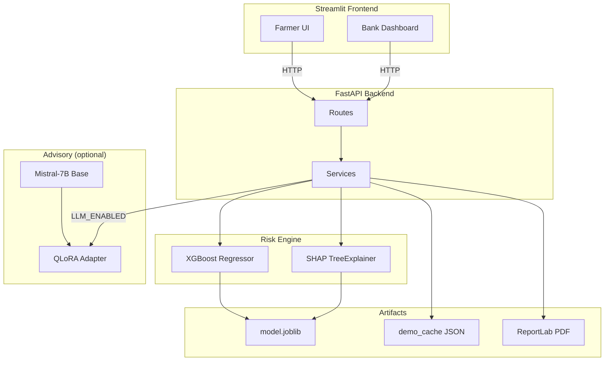

# FarmCredit AI

**AI-Powered Crop Loan Default Predictor and Agricultural Advisory System for Indian Farmers**

[]()
[]()
[]()
[]()

---

## The problem

For millions of Indian smallholder farmers, a crop loan is not just credit — it is the difference between planting a season and skipping one. When repayment fails, the **poverty trap** tightens: debt rolls over, input costs rise, and the next season starts from a weaker position. Banks face the opposite problem — approving loans that default erodes portfolio quality; rejecting good farmers deepens exclusion.

**FarmCredit AI** is a full-stack demonstration of how machine learning, explainability, and instruction-tuned language models can support **better-informed** lending and farmer advisory — scoring default risk from agri-credit features, explaining *why* a score was assigned, and translating results into plain-language guidance on crops, schemes, and repayment planning.

> **Portfolio disclaimer:** This project uses **realistic synthetic data**, not real farmer or bank records. The engineering pipeline (train → evaluate → explain → serve → report) is production-shaped; the underlying records are for demonstration only.

---

## Demo

| Resource | Link |
|---|---|
| **Live demo** | _Coming soon — add Streamlit Cloud URL_ |
| **API docs** | `http://127.0.0.1:8000/docs` (local) |
| **HuggingFace adapter** | _your-username/farmcredit-ai-mistral-7b_ |

### Screenshots

_Add GIFs or screenshots here:_

| Farmer flow | Bank officer dashboard |
|---|---|
| _screenshot: Try Demo + risk badge + SHAP_ | _screenshot: queue + state risk chart_ |
| _screenshot: PDF report download_ | _screenshot: approve/flag workflow_ |

---

## What it does

### Farmer side (Streamlit)

| Feature | Description |
|---|---|
| **Risk scoring** | XGBoost predicts `default_risk` (0–1) and maps to Low / Medium / High / Critical |
| **Explainable AI** | SHAP top factors in plain language — what raised or lowered the score |
| **Try Demo** | One-click profiles (DEMO-01 … DEMO-05) spanning the full risk spectrum |
| **Custom assessment** | Full input form: state, crop, soil, rainfall, loan, repayment history |
| **Advisory** | Farmer-friendly guidance (demo cache, template, or live fine-tuned Mistral) |
| **Scheme pointers** | Indicative PM-KISAN, KCC, PMFBY eligibility language |
| **Repayment framing** | Advisory includes practical next steps tied to income and loan burden |
| **PDF report** | Downloadable ReportLab brief: summary, risk, SHAP, advisory, schemes |

### Bank officer side (Streamlit dashboard)

| Feature | Description |
|---|---|
| **Application queue** | 5 demo farmers + 40 illustrative synthetic applications |
| **Risk filtering** | Filter by band, state, decision status; search by name/ID |
| **Approve / Flag workflow** | Session-based officer decisions (demo — no persistent DB) |
| **State risk view** | Bar charts of average risk and High+Critical counts by state |
| **Export** | Download filtered queue as CSV or JSON |

---

## Architecture



**Layering**

| Layer | Role |
|---|---|
| `frontend/` | Streamlit pages, components, API client |
| `backend/app/api/routes/` | HTTP endpoints (`/assess`, `/generate-report/pdf`, …) |
| `backend/app/services/` | Orchestration: risk, explain, advisory, demo cache, reports |
| `backend/app/ml/` | Runtime XGBoost loader + SHAP wrapper |
| `backend/app/llm/` | Mistral + PEFT adapter client (optional) |
| `backend/app/reports/` | JSON → PDF via ReportLab |
| `ml/` | Training pipeline, artifacts, evaluation |

**Typical request flow (demo farmer)**

1. User clicks **Load DEMO-03** in Streamlit  
2. `GET /demo-farmers/DEMO-03` → precomputed cache (score, SHAP, advisory)  
3. UI renders risk badge + factor chart + advisory  
4. **Prepare PDF** → `POST /generate-report/pdf` → ReportLab bytes → download  

**Custom farmer flow:** same path, but `/assess` runs live XGBoost + SHAP; advisory uses template unless `LLM_ENABLED=true`.

---

## Tech stack

| Layer | Technology | Why |
|---|---|---|
| **Frontend** | Streamlit | Fast portfolio UI; forms, charts, multi-page demo |
| **Backend** | FastAPI, Pydantic, Uvicorn | Typed APIs, OpenAPI docs, async-ready |
| **Risk model** | **XGBoost** | Strong on tabular mixed data; learns crop × climate × credit interactions |
| **Explainability** | **SHAP** (TreeExplainer) | Local, directional attributions — required for credit-style “why” |
| **LLM base** | Mistral-7B-Instruct-v0.3 | Ungated instruct model; good for QLoRA demos |
| **Fine-tuning** | **QLoRA** (PEFT + bitsandbytes) | Train adapters on free GPU; base weights frozen |
| **Reports** | ReportLab | Server-side PDF without a headless browser |
| **Deployment** | Docker, Render / Streamlit Cloud | CPU backend (LLM off) + hosted frontend |

---

## AI / ML deep dive

### 1. XGBoost risk engine

**Target:** `default_risk` ∈ [0, 1] (regression), displayed as bands:

| Band | Score |
|---|---|
| Low | &lt; 0.25 |
| Medium | 0.25 – 0.50 |
| High | 0.50 – 0.75 |
| Critical | ≥ 0.75 |

**Features (14 inputs):** state, district, crop, season, land size, soil, rainfall, irrigation, loan amount, prior loan count, prior default flag, repayment score, annual income, existing debt.

**Training:** 10,000 synthetic rows (70/15/15 split), native categorical support, early stopping, regularization (`max_depth=5`, `subsample=0.8`, `colsample_bytree=0.8`).

**Why XGBoost:** Farmer credit data is structured and tabular. Risk is driven by **interactions** (e.g. rainfed cotton in a dry zone + high debt), which tree ensembles capture without hand-crafted rules. Training is fast, metrics are strong, and the model pairs cleanly with SHAP.

### 2. SHAP explainability

**Why it matters for lending:** A score alone is not enough for farmers, officers, or auditors. SHAP answers: *“Which inputs pushed this application above or below average risk?”*

**How it works here:** `TreeExplainer` computes Shapley-style contributions per feature. Each factor includes:

- signed impact (`shap_value`, `points`)
- direction (`increases_risk` / `decreases_risk`)
- `plain_hint` for farmer-facing copy

Contributions sum from a baseline to the final prediction — every demo and custom score is explainable in the API and PDF.

### 3. QLoRA fine-tuning (Mistral advisory)

| Item | Detail |
|---|---|
| **Base model** | `mistralai/Mistral-7B-Instruct-v0.3` |
| **Adapter** | LoRA weights on HuggingFace Hub (`your-username/farmcredit-ai-mistral-7b`) |
| **Dataset** | ~400 Alpaca-format instruction pairs (risk Q&A, schemes, crop advice, repayment) |
| **Typical LoRA config** | rank `r=16`, alpha `32`, target modules `q_proj`, `k_proj`, `v_proj`, `o_proj` |
| **Quantization** | 4-bit NF4 load (bitsandbytes) for train + optional inference |
| **Why QLoRA vs full fine-tune** | Full 7B fine-tuning needs ~28GB+ VRAM; QLoRA trains only adapter matrices (~millions of params) with a frozen base — feasible on Colab/free GPU |
| **4-bit tradeoff** | ~5–6GB VRAM vs ~14GB+ fp16; small quality loss, acceptable for demo advisory tone |

**Training loss:** _Add your final train/eval loss from your fine-tuning run (Colab/notebook). Adapter artifacts live on HuggingFace, not in this repo._

**Loading strategy:** **Adapter-on-base** via `PeftModel.from_pretrained` — smaller Hub artifact, same stack as training. Merged full weights were not required for this demo.

**Runtime note:** Public deploy keeps `LLM_ENABLED=false`. Live inference needs GPU + `HF_TOKEN`; demo cache and template advisory cover the portfolio path.

---

## Data disclosure

This project does **not** use real NABARD, IMD, ICAR, or bank microdata.

| What we built | How |
|---|---|
| **10,000 tabular rows** | Synthetic generator with state/crop/soil priors + correlation rules |
| **Risk labels** | Latent stress function (climate × crop × leverage × history) + noise |
| **Instruction JSONL** | Template-generated farmer Q&A for QLoRA |
| **Demo farmers** | Hand-crafted profiles (DEMO-01 … DEMO-05) |
| **Officer queue** | 40 additional synthetic applications for dashboard density |

The data **behaves** like real agri-credit patterns so the model learns meaningful structure. It must **not** be cited as official statistics or used for real credit decisions.

See [`data/README.md`](data/README.md) for schema and generation notes.

---

## Local setup

### Prerequisites

- Python **3.10 or 3.11** recommended  
- Two PowerShell windows  
- Pre-trained model already in repo — **no training required**

### From scratch (copy each block)

**One-time install** — run once in PowerShell:

```powershell
cd "C:\Users\Kavirathna\OneDrive\Desktop\resume projects\Frarmcredit"

python -m venv .venv
.\.venv\Scripts\Activate.ps1

pip install -r requirements-demo.txt
```

**Every time you run the app** — you need **two terminals**, both in the same folder, both with venv activated.

**Terminal 1 — backend** (keep this open):

```powershell
cd "C:\Users\Kavirathna\OneDrive\Desktop\resume projects\Frarmcredit"
.\.venv\Scripts\Activate.ps1
$env:PYTHONPATH = (Get-Location).Path
python -m uvicorn backend.app.main:app --host 127.0.0.1 --port 8000
```

Wait until you see: `Uvicorn running on http://127.0.0.1:8000`

**Terminal 2 — website** (new PowerShell window):

```powershell
cd "C:\Users\Kavirathna\OneDrive\Desktop\resume projects\Frarmcredit"
.\.venv\Scripts\Activate.ps1
$env:PYTHONPATH = (Get-Location).Path
$env:FARMCREDIT_API_URL = "http://127.0.0.1:8000"
python -m streamlit run frontend/streamlit_app.py
```

Browser opens → **http://localhost:8501** → click **Load DEMO-01**.

> Use `requirements-demo.txt` (small install). You already ran `backend/requirements.txt` — that also works, but it is much larger.

### Environment variables

**Backend** (`backend/.env`):

| Variable | Default | Purpose |
|---|---|---|
| `LLM_ENABLED` | `false` | `true` = load Mistral + adapter (GPU, HF token) |
| `HF_TOKEN` | — | Required for private Hub adapter |
| `HF_MODEL_ID` | your adapter repo | PEFT weights |
| `HF_BASE_MODEL` | `mistralai/Mistral-7B-Instruct-v0.3` | Frozen base |
| `MODEL_DIR` | `ml/artifacts/model` | XGBoost bundle |
| `DEMO_CACHE_DIR` | `backend/app/data/demo_cache` | Instant demo responses |

**Frontend:**

| Variable | Default | Purpose |
|---|---|---|
| `FARMCREDIT_API_URL` | `http://127.0.0.1:8000` | Backend base URL |

### `LLM_ENABLED`: off vs on

| | `LLM_ENABLED=false` (default) | `LLM_ENABLED=true` |
|---|---|---|
| **Advisory source** | Demo cache + template text | Fine-tuned Mistral generation |
| **Hardware** | CPU only | GPU strongly recommended |
| **Startup** | Seconds | Minutes (model download) |
| **Deploy** | Render / Streamlit free tier | Local or paid GPU host |

---

## Project structure

```text
Frarmcredit/
├── backend/           FastAPI app — routes, services, ML/LLM runtime, PDF, demo cache
├── frontend/          Streamlit farmer UI + bank dashboard + API client
├── ml/                XGBoost training, evaluation, SHAP batch tools, model artifacts
├── data/              Synthetic CSVs, reference priors, data documentation
├── scripts/           End-to-end API test runner (e2e_test.py)
├── requirements-demo.txt   Lean deps to run the demo
├── Dockerfile         CPU deploy (LLM disabled)
└── README.md          This file
```

---

## Results / metrics

### XGBoost (held-out test set, n=1,500)

| Metric | Value |
|---|---|
| **RMSE** | 0.080 |
| **MAE** | 0.063 |
| **AUC-ROC** (threshold 0.5) | 0.962 |
| **Precision** | 0.876 |
| **Recall** | 0.808 |
| **F1** | 0.841 |
| **Accuracy** | 0.891 |
| **Band accuracy** | 0.742 |
| **Val RMSE** (early stopping) | 0.080 |

Confusion matrix (binary @ 0.5): TN=907, FP=61, FN=102, TP=430.

### QLoRA fine-tuning

| Metric | Value |
|---|---|
| Instruction pairs | ~400 |
| Final train loss | _Add from your training notebook_ |
| Final eval loss | _Add from your training notebook_ |

### Demo farmer profiles

| ID | Persona | Band | Score |
|---|---|---|---|
| DEMO-01 | Punjab wheat, canal | **Low** | 0.050 |
| DEMO-02 | MH soybean smallholder | **Medium** | 0.409 |
| DEMO-03 | MH rainfed cotton | **High** | 0.681 |
| DEMO-04 | BR rice, prior default | **Critical** | 1.000 |
| DEMO-05 | RJ millet + drip (edge) | **Medium** | 0.289 |

---

## API reference (key endpoints)

| Method | Path | Description |
|---|---|---|
| GET | `/health` | Model + LLM load status |
| GET | `/demo-farmers` | List demo profiles |
| GET | `/demo-farmers/{id}` | Cached bundle (score, SHAP, advisory) |
| POST | `/assess` | Full pipeline: predict + explain + advisory |
| POST | `/predict-risk` | XGBoost score (+ optional SHAP) |
| POST | `/explain-risk` | SHAP explanation |
| POST | `/advisory` | Advisory text only |
| POST | `/generate-report` | JSON report |
| POST | `/generate-report/pdf` | PDF download |

---

## Future improvements

Production-ready FarmCredit would require work beyond this portfolio scope:

- **Real data partnership** — anonymized agri-credit datasets with proper governance  
- **GPU-hosted LLM** in production with latency SLAs and fallbacks  
- **Authentication & RBAC** for bank officers and farmer accounts  
- **Persistent database** instead of session state and JSON caches  
- **Model monitoring** — drift detection on state/crop/rainfall distributions  
- **Regulatory review** — fair lending audits, adverse action notices, human-in-the-loop  
- **Regional language** — Hindi/Kannada/Marathi advisory beyond English demo  
- **Mobile-first UX** — USSD or lightweight app for low-bandwidth farmers  

---

## Author

**Your Name**  
🔗 [LinkedIn](https://linkedin.com/in/your-profile)  
🌐 [Portfolio](https://your-portfolio.com)  
📧 your.email@example.com  

---

## License

Portfolio / educational demonstration. Synthetic data only — not for production credit decisions.
